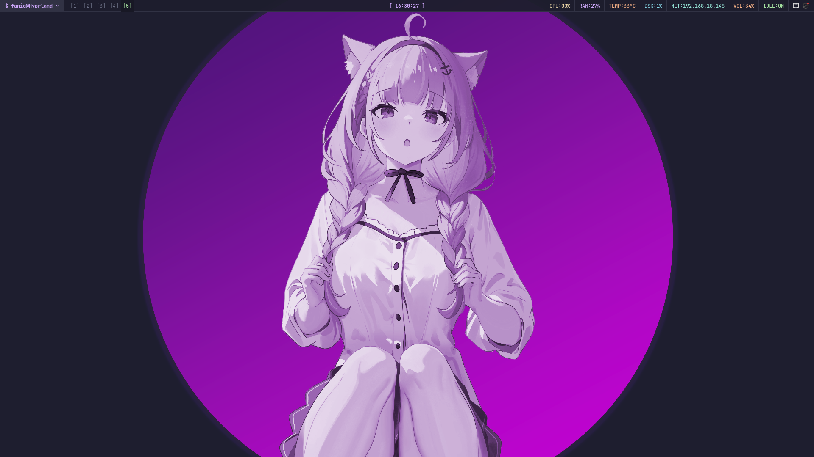
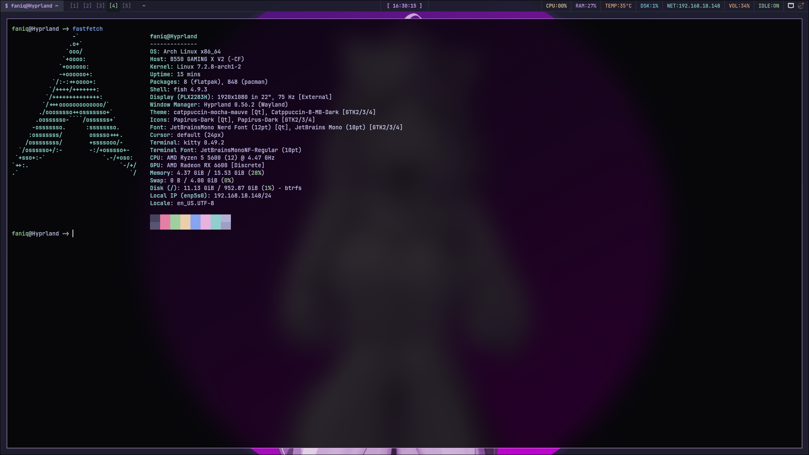

# Hyprland Dotfiles

A personal Hyprland desktop setup for Arch Linux, styled with Catppuccin Mocha Mauve.

These dotfiles are for my personal use and are provided as-is. Use them at your own risk; I do not provide support if anything breaks.

## Screenshots





## Components

- Hyprland window manager configuration in Lua
- Waybar status bar
- Wofi application and clipboard menus
- SwayOSD volume and input controls
- Dunst notifications
- Kvantum, GTK, and Qt appearance settings
- Kitty terminal, Fish shell, and related desktop preferences

See [binds.md](binds.md) for the keyboard and mouse shortcuts.

## Installation

Requirements: Arch Linux, `sudo` access, and an installed AUR helper (`paru` or `yay`). Run the installer as your regular user, not with `sudo`:

```bash
git clone https://github.com/ViaFaniq/Hyprland-Dotfiles.git
cd Hyprland-Dotfiles
./install.sh
```

The installer upgrades system packages with `pacman -Syu`, installs the required packages from the Arch repositories and AUR, then copies the contents of `.config/` into `~/.config/`. Existing files with matching paths may be overwritten. Restart your Hyprland session after installation.

### Packages

The installer installs these AUR packages with your selected helper:

- `wlogout`
- `visual-studio-code-bin`
- `equibop-bin`
- `catppuccin-gtk-theme-mocha`

The rest are installed from the configured Arch repositories, including Hyprland, Waybar, Wofi, Kitty, Dolphin, Firefox, SwayOSD, PipeWire, NetworkManager, screenshot and clipboard tools, and GTK/Qt theming utilities. `nmtui`, used by Waybar, comes from `networkmanager`.

## Configuration Layout

```text
.config/
├── dunst/
├── fish/
├── gtk-3.0/
├── gtk-4.0/
├── hypr/
│   └── hyprland.lua
├── kitty/
├── Kvantum/
├── nwg-look/
├── qt6ct/
├── swayosd/
├── waybar/
├── wlogout/
├── wofi/
├── xsettingsd/
├── kdeglobals
└── pavucontrol.ini
```
